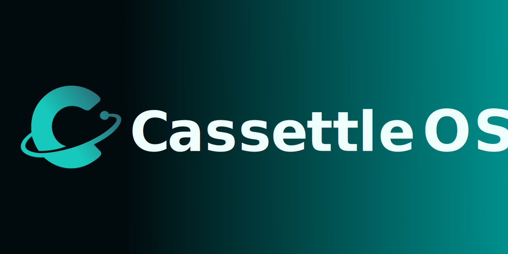

<p style="text-align:center">inspired by CasaOS</p>

# CassetteOS
**未来オフィスのインフラ**  
CassetteOSは、小規模チームやオフィス向けに最適化された業務サーバーOS。  
必要なアプリをすぐに導入でき、外部サービスに依存しない運用が可能です。

> ※このプロジェクトは [CasaOS](https://github.com/IceWhaleTech/CasaOS) をベースに開発されており、  
> 素晴らしいオープンソースプロジェクトであるCasaOSに深いリスペクトを表します。


[CassetteOS公式サイト](https://www.cassetteos.com)

## 概要
✔ ファイルサーバー機能を標準搭載  
✔ 必要なアプリだけを厳選して提供  
✔ シンプルな操作と導入のしやすさ


## 🚀 インストール（Installation）

```bash
wget -qO- https://github.com/BeesNestInc/CassetteOS-Tools/releases/download/v0.0.6/install.sh | sudo bash
```

