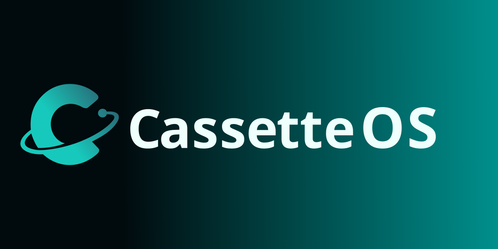

<p style="text-align:center">inspired by CasaOS</p>

# CassetteOS
**未来オフィスのインフラ**  
CassetteOSは、スマホの感覚で扱えるサーバ用OSで、
必要なアプリをすぐに導入でき、外部サービスに依存しない運用が可能です。

> ※このプロジェクトは [CasaOS](https://github.com/IceWhaleTech/CasaOS) をベースに開発されており、  
> 素晴らしいオープンソースプロジェクトであるCasaOSに深いリスペクトを表します。


[CassetteOS公式サイト](https://www.cassetteos.com)

## 概要
✔ ファイルサーバー機能を標準搭載  
✔ 必要なアプリだけを厳選して提供  
✔ シンプルな操作と導入のしやすさ

## 🚀 インストール（Installation）
⚠️ インストールに伴う影響について

本インストーラーは動作に必要な初期設定のため、無線/AP（hostapd）・PostgreSQL などの構成を変更します。  
その結果、既存設定の上書き／サービス再起動 が発生します。  
バックアップの取得と検証環境での事前確認を強く推奨します。インストーラー内でもバックアップを作成しますが、世代管理は行いません（上書きの可能性あり）。  
また、現在のバージョンでは無線デバイスが見つからない場合にインストール途中で失敗します。

**1) ダウンロード**
```bash
wget -O cassetteos-install.sh \
  https://github.com/BeesNestInc/CassetteOS-Tools/releases/download/v0.0.9/install.sh
```

**2) 実行**

インストールは対話式です。 途中でAPモード起動の有無の確認 と AP（アクセスポイント）の SSID／パスワード を入力があります。
```bash
sudo bash /tmp/cassetteos-install.sh
```

## WiFiセットアップ機能
CassetteOSのWiFiセットアップ機能では、インストールした機器を既存のネットワークに接続したり、APモードとして動作させることができます。  
この機能ではCassetteOSが直接ネットワークの設定を変更してしまうため、NetworkManager等がネットワーク管理ソフトウェアがすでにある場合お互いに機能が干渉してうまく動作しないことがあります。
